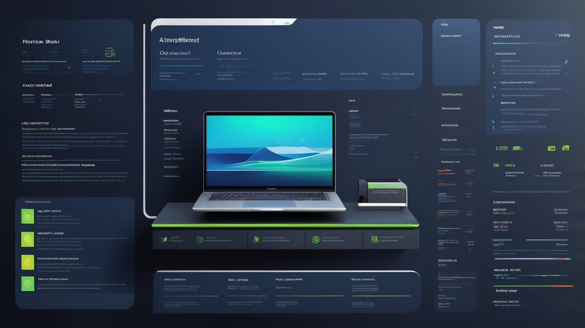

# Testing Showcase Project

  

This project demonstrates a full-stack application with comprehensive testing strategies for both the client (React + Vite) and server (Node.js + Express + MongoDB) sides. It is designed as a reference for best practices in code organization, testing, and modern web development workflows.

## Table of Contents
- [Project Structure](#project-structure)
- [Features](#features)
- [Getting Started](#getting-started)
- [Scripts](#scripts)
- [Testing](#testing)
- [Tech Stack](#tech-stack)
- [Folder Structure](#folder-structure)
- [Contributing](#contributing)
- [License](#license)

---

## Project Structure

```
client/           # Frontend React app (Vite)
server/           # Backend Node.js/Express API
```

## Features
- **Book Management**: Create, view, and manage books.
- **Full CRUD API**: RESTful endpoints for book resources.
- **Comprehensive Testing**: Unit, integration, functional, and performance tests for both client and server.
- **Modern Tooling**: Vite, React, Jest, and more.

## Getting Started

### Prerequisites
- Node.js (v16+ recommended)
- npm or yarn
- MongoDB (for server)

### Setup

#### 1. Clone the repository
```sh
git clone <repo-url>
cd <repo-root>
```

#### 2. Install dependencies
```sh
cd client
npm install
cd ../server
npm install
```

#### 3. Configure Environment
- Set up MongoDB and update `server/config/db.js` if needed.

#### 4. Run the app
- **Start server:**
  ```sh
  cd server
  npm start
  ```
- **Start client:**
  ```sh
  cd client
  npm run dev
  ```

## Scripts

### Client
- `npm run dev` — Start Vite dev server
- `npm run build` — Build for production
- `npm run test` — Run frontend tests

### Server
- `npm start` — Start Express server
- `npm test` — Run backend tests

## Testing

### Client
- Located in `client/src/components/tests/`
- Uses Jest and React Testing Library
- Run with `npm test` in the `client` directory

### Server
- Located in `server/tests/`
- Uses Jest and supertest
- Includes:
  - Functional API tests
  - Database integration tests
  - Performance tests
- Run with `npm test` in the `server` directory

## Tech Stack
- **Frontend:** React, Vite, Jest, React Testing Library
- **Backend:** Node.js, Express, MongoDB, Jest, supertest

## Folder Structure

```
client/
  src/
    components/         # React components
      tests/            # Component tests
    pages/              # Page components
    assets/             # Static assets
  public/               # Public files
  ...
server/
  controllers/          # Express controllers
  models/               # Mongoose models
  routes/               # API routes
  config/               # DB config
  tests/                # All server-side tests
    Functional API Testing/
    Database Integration Testing/
    Book Performance Testing/
  ...
```

